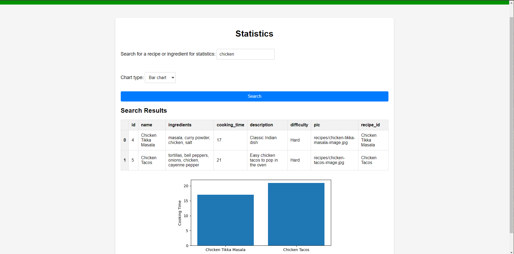

# recipe-app

## Description

This is a full stack web application using Python and the Django framework. Deployed using Heroku and using the database Postgres. This is a recipe application designed to allow users to enter recipes and look at other recipes information.

## Live Website:

Check out the live website [here!](https://fathomless-bayou-32636-f19964bde80a.herokuapp.com/)

## Screenshots of Application:

## Features

- Allow users to login and logout
- Users can add new recipes
- Users can search recipes according to ingredients they enter
- Includes a Django Admin dashboard
- Shows statistics and visualizations based on search input

## Technologies Used:

- HTML5
- CSS
- Python
- Django
- Sqlite

## Get Started:

Before you begin make sure you have the following software installed:

- Python 3.8 or higher
- Django 3

1. Clone the repository [here](https://github.com/mrfukui/Recipe-App)

2. Install the requirements with "pip install -r requirements.txt"

3. Migrate the database with "python manage.py migrate"

4. Run the local server with "python manage.py runserver"

## Acknowledgments:

-CareerFoundry for guidance in building this app.
